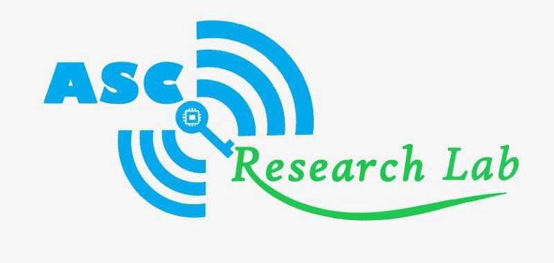

OS-Security group meeting records of _ASC Research Lab_, _NUAA_

The update of this table should follow the rules [here](https://github.com/mrdrivingduck/ASC-OS-Security-group-meeting/blob/master/README.md).

| Date       | Classification     | Content                                                      | Speaker | Resources                                                    |
| ---------- | ------------------ | ------------------------------------------------------------ | ------- | ------------------------------------------------------------ |
| 2019/10/16 | Paper sharing      | Exploring Effective Fuzzing Strategies to Analyze Communication Protocols | 马祖超  | [Paper](https://raw.githubusercontent.com/mrdrivingduck/ASC-OS-Security-group-meeting/master/resource/20191016-mzc-pfuzz/PF_FEAST_2019.pdf) [Slide](https://raw.githubusercontent.com/mrdrivingduck/ASC-OS-Security-group-meeting/master/resource/20191016-mzc-pfuzz/PF_FEAST_2019_Slides.pdf) |
| 2019/10/14 | Paper sharing      | Faulds: A Non-Parametric Iterative Classifier for Internet-Wide OS Fingerprinting | 祝方舟  | [Paper](https://raw.githubusercontent.com/mrdrivingduck/ASC-OS-Security-group-meeting/master/resource/20191014-zfz-osfingerprinting/A%20Non-Parametric%20Iterative%20Classifier.pdf) [Slide](https://raw.githubusercontent.com/mrdrivingduck/ASC-OS-Security-group-meeting/master/resource/20191014-zfz-osfingerprinting/ccs2017-ppt.pdf) |
| 2019/10/14 | Paper sharing      | EnFuzz: Ensemble Fuzzing  with Seed Synchronization among Diverse Fuzzers | 周滕  | [Paper](https://raw.githubusercontent.com/mrdrivingduck/ASC-OS-Security-group-meeting/master/resource/20191014-tengzhou-enfuzz/EnFuzz%20EnsembleFuzzingwithSeedSynchronizationamongDiverseFuzzers.pdf) [Slide](https://raw.githubusercontent.com/mrdrivingduck/ASC-OS-Security-group-meeting/master/resource/20191014-tengzhou-enfuzz/enfuzz.pdf) |
| 2019/09/11 | Paper sharing      | DIFUZE: Interface Aware Fuzzing for Kernel Drivers           | 张靖棠  | [Paper](https://raw.githubusercontent.com/mrdrivingduck/ASC-OS-Security-group-meeting/master/resource/20190911-zjt-DIFUZE/p2123-corinaA.pdf) [Slide](https://raw.githubusercontent.com/mrdrivingduck/ASC-OS-Security-group-meeting/master/resource/20190911-zjt-DIFUZE/DIFUZE.pdf) |
| 2019/09/10 | Paper sharing      | Precise and Scalable Detection of Double-Fetch Bugs in OS Kernels | 周滕  | [Paper](https://raw.githubusercontent.com/mrdrivingduck/ASC-OS-Security-group-meeting/master/resource/20190710-zt-deadline/Precise%20and%20scalable%20detection%20of%20double-fetch%20bugs%20in%20OS%20kernels%20ieee%20sp2018.pdf) [Slide](https://raw.githubusercontent.com/mrdrivingduck/ASC-OS-Security-group-meeting/master/resource/20190710-zt-deadline/deadline.pdf) |
| 2019/07/29 | Paper sharing      | Fuzzing File Systems via Two-Dimensional Input Space Exploration | 张靖棠  | [Paper](https://raw.githubusercontent.com/mrdrivingduck/ASC-OS-Security-group-meeting/master/resource/20190729-zjt-filesystem/xu-janus.pdf) [Slide](https://raw.githubusercontent.com/mrdrivingduck/ASC-OS-Security-group-meeting/master/resource/20190729-zjt-filesystem/filesystem.pdf) |
| 2019/07/24 | Paper sharing      | kAFL: Hardware-Assisted Feedback Fuzzing for OS Kernels  | 周滕  | [Paper](https://raw.githubusercontent.com/mrdrivingduck/ASC-OS-Security-group-meeting/master/resource/20190724-zt-KAFL/kAFL%20Hardware-Assisted%20Feedback%20Fuzzing%20%20for%20OS%20Kernels.pdf) [Slide](https://raw.githubusercontent.com/mrdrivingduck/ASC-OS-Security-group-meeting/master/resource/20190724-zt-KAFL/KAFL%20and%20AFL.pdf) |
| 2019/07/23 | Paper sharing      | CollAFL: Path Sensitive Fuzzing | 马祖超  | [Paper](https://raw.githubusercontent.com/mrdrivingduck/ASC-OS-Security-group-meeting/master/resource/20190723-mzc-collafl/SP18_ColLAFL.pdf) [Slide](https://raw.githubusercontent.com/mrdrivingduck/ASC-OS-Security-group-meeting/master/resource/20190723-mzc-collafl/CollAFL.pdf) |
| 2019/07/17 | Technology Sharing | Overview of _Google syzkaller_                               | 张靖棠  | [Slide](https://raw.githubusercontent.com/mrdrivingduck/ASC-OS-Security-group-meeting/master/resource/20190717-zjt-syzkaller/syzkaller.pdf) |
| 2019/07/17 | Paper sharing      | Defending against Malicious Peripherals with Cinch           | 马祖超  | [Paper](https://raw.githubusercontent.com/mrdrivingduck/ASC-OS-Security-group-meeting/master/resource/20190710-mzc-cinch/sec16_paper_angel.pdf) [Slide](https://raw.githubusercontent.com/mrdrivingduck/ASC-OS-Security-group-meeting/master/resource/20190710-mzc-cinch/Cinch_Slides.pdf) |
| 2019/07/10 | Paper sharing      | CodeAlchemist: Semantics-Aware Code Generation to Find Vulnerabilities in JavaScript Engines  | 周滕  | [Paper](https://raw.githubusercontent.com/mrdrivingduck/ASC-OS-Security-group-meeting/master/resource/20190910-zt-CodeAlchemist/CodeAlchemist%20Semantics-Aware%20Code%20Generation%20to%20Find%20Vulnerabilities%20in%20JavaScript%20Engines.pdf) [Slide](https://raw.githubusercontent.com/mrdrivingduck/ASC-OS-Security-group-meeting/master/resource/20190910-zt-CodeAlchemist/CodeAlchemist.pdf) |
| 2019/06/19 | Paper sharing      | Charm: Facilitating Dynamic Analysis of Device Drivers of Mobile Systems | 王益挺  | [Paper](https://raw.githubusercontent.com/mrdrivingduck/ASC-OS-Security-group-meeting/master/resource/20190619-wyt-charm/sec18-talebi.pdf) [Slide](https://raw.githubusercontent.com/mrdrivingduck/ASC-OS-Security-group-meeting/master/resource/20190619-wyt-charm/security18_slides_talebi.pdf) |
| 2019/05/31 | Paper sharing      | PeriScope: An Effective Probing and Fuzzing Framework for the Hardware-OS Boundary | 马祖超  | [Paper](https://raw.githubusercontent.com/mrdrivingduck/ASC-OS-Security-group-meeting/master/resource/20190531-mzc-periscope/PeriScope.pdf) [Slide](https://raw.githubusercontent.com/mrdrivingduck/ASC-OS-Security-group-meeting/master/resource/20190531-mzc-periscope/ndss2019_04A-1_Song_slides.pdf) |
| 2019/05/29 | Paper sharing      | How Double-Fetch Situations turn into Double-Fetch Vulnerabilities: A Study of Double Fetches in the Linux Kernel | 张靖棠  | [Paper](https://raw.githubusercontent.com/mrdrivingduck/ASC-OS-Security-group-meeting/master/resource/20190529-zjt-double-fetch/sec17-wang.pdf) [Slide](https://raw.githubusercontent.com/mrdrivingduck/ASC-OS-Security-group-meeting/master/resource/20190529-zjt-double-fetch/double-fetch.pdf) |

